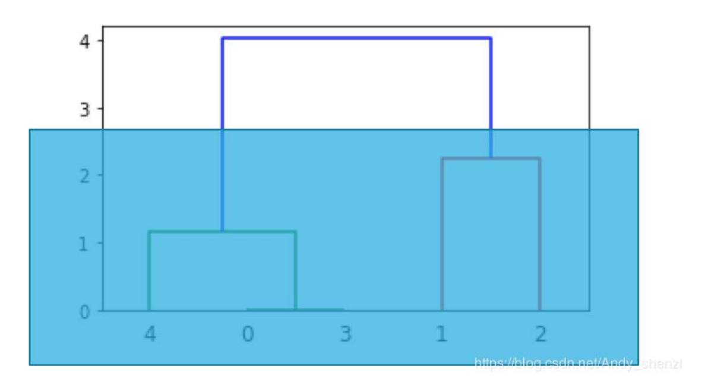

#### 聚类的常见算法

1. 原型聚类
   - K均值聚类算法
   - 学习向量量化
   - 高斯混合聚类
2. 层次聚类
3. 密度聚类

##### K-Means聚类算法

- K-Means算法是一种原型聚类算法	

- K-Means聚类是最常用的聚类算法，最初起源于信号处理，其目标是将数据点划分为K个类簇，找到每个蔟的中心并使其度量化

- 优点：
  - 是解决聚类问题的一种景点算法，简单、快速
  - 对于处理大数据集，该算法保持可伸缩性和高效率
  - 当结果簇是密集的，它的效果较好
  
- 缺点：
  
  - 只能应用于连续型数据，并且要在聚类前指定聚集的类簇数
  - 在簇的平均值可被定义的情况下才能使用，可能不适用于某些应用
  - 必须事先给出K(要生成的簇的数目)，而且对初始值敏感，对于不同的初始值，可能会导致不同的结果(一个结果集分成2类和3类所对应的结果是不一样的)
  - 不适合发现非凸形状的簇或者大小差异很大的簇
  - 对噪声和孤立点数据敏感
  
- K-Means聚类算法的执行流程：
  1. 确定K值，即将数据集聚集成K个类簇或小组
  2. 从数据集中随机选择K个数据点作为质心或数据中心
  3. 分别计算每个点到每个质心之间的距离，并将每个点划分到离最近质心的小组
  4. 当每个质心都聚集了一些点后，重新定义算法选出新的质心。(对于每个蔟，计算均值，得到新的质心)
  5. 迭代第三步到第四步，直到迭代终止条件满足为止
  
- 常见使用方式

  - openCV版本

    > ```python
    > import cv2
    > import numpy as np
    > 
    > #读取原始图像
    > img = cv2.imread('lenna.png') 
    > 
    > #图像二维像素转换为一维
    > data = img.reshape((-1,3))
    > data = np.float32(data)
    > 
    > #设置策略 (type,max_iter,epsilon)
    > # type 策略
    > # cv2.TERM_CRITERIA_EPS 如果满足了指定准确度，epsilon就停止算法迭代
    > # cv2.TERM_CRITERIA_MAX_ITER 在指定次数的迭代后就停止算法
    > # cv2.TERM_CRITERIA_EPS + cv2.TERM_CRITERIA_MAX_ITER 上边两个条件任意一个满足就停止
    > # max_iter 最大迭代次数
    > # epsilon 获得精度到达指定值的时候停止
    > criteria = (cv2.TERM_CRITERIA_EPS + cv2.TERM_CRITERIA_MAX_ITER, 10, 1.0)
    > 
    > # 设置标签(随机选取中心)
    > flags = cv2.KMEANS_RANDOM_CENTERS
    > 
    > # K-Means聚类，聚集成2类
    > # cv2.kmeans(data,)
    > # data 数据
    > # bestLabels 预设的分类标签
    > # K 聚类的个数
    > # criteria 终止迭代条件
    > # attempts 重复试验kmeans次数，返回最好结果
    > # flags 初始类中心选择
    > compactness, labels,centers = cv2.kmeans(data, 2, None, criteria, 10, flags)
    > ```

  - sklean版本

    > ```python
    > from sklearn.cluster import KMeans
    > 
    > """
    > 第一部分：数据集
    > X表示二维矩阵数据，篮球运动员比赛数据
    > 总共20行，每行两列数据
    > 第一列表示球员每分钟助攻数：assists_per_minute
    > 第二列表示球员每分钟得分数：points_per_minute
    > """
    > X = [[0.0888, 0.5885],
    >      [0.1399, 0.8291],
    >      [0.0747, 0.4974],
    >      [0.0983, 0.5772],
    >      [0.1276, 0.5703],
    >      [0.1671, 0.5835],
    >      [0.1306, 0.5276],
    >      [0.1061, 0.5523],
    >      [0.2446, 0.4007],
    >      [0.1670, 0.4770],
    >      [0.2485, 0.4313],
    >      [0.1227, 0.4909],
    >      [0.1240, 0.5668],
    >      [0.1461, 0.5113],
    >      [0.2315, 0.3788],
    >      [0.0494, 0.5590],
    >      [0.1107, 0.4799],
    >      [0.1121, 0.5735],
    >      [0.1007, 0.6318],
    >      [0.2567, 0.4326],
    >      [0.1956, 0.4280]   
    >     ]
    > """
    > 第二部分：KMeans聚类
    > clf = KMeans(n_clusters=3) 表示类簇数为3，聚成3类数据，clf即赋值为KMeans
    > y_pred = clf.fit_predict(X) 载入数据集X，并且将聚类的结果赋值给y_pred
    > """
    > clf = KMeans(n_clusters=3)
    > y_pred = clf.fit_predict(X)
    > 
    > #输出完整Kmeans函数，包括很多省略参数
    > print(clf)
    > #输出聚类预测结果
    > print("y_pred = ",y_pred)
    > ```
    >
    > 

##### 层次聚类

- 层次聚类是一种很直观的算法。顾名思义就是要一层一层地进行聚类
- **层次法**先计算样本之间的距离，每次将距离最近的点合并到同一个类，然后，再计算类与类之间的距离，将距离最近的类合并为一个大类，不停的合并，直到合成了一个类
  - 类与类的距离计算方法有：
  - 最短距离法：将类与类的距离定义为类与类之间样本的最短距离
  - 最长距离法
  - 中间距离法
  - 类平均法
- 层次聚类算法根据层次分解的顺序分为：自下底向上和自上向下
  - 凝聚的层次聚类算法(自下而上法)
  - 分裂的层次聚类算法(自上而下法)
- 计算流程
  1. 将每个对象看作一类，计算两两之间的最小距离
  2. 将距离最小的两个类合并成一个新类
  3. 重新计算新类与所有类之间的距离
  4. 重复2,3直到所有类合并成一类
- 特点
  - 凝聚的层次聚类并没有类似K均值的全局目标函数，没有局部极小问题或是很难选择初始点的问题
  - 合并的操作往往是最终的，一旦合并两个簇之后就不会撤销
  - 当然其计算存储的代价是昂贵的
- 优点
  - 距离和规则的相似度容易定义，限制少
  - 不需要预先制定聚类数(也就是这个聚类算法是将所有的聚类数情况都计算了一遍，到时候用的时候直接取值就行)
  - 可以发现类的层次关系
  - 可以聚类成其他形状
- 缺点
  - 计算复杂度太高
  - 奇异值也能产生很大影响
  - 算法很可能聚类成链状
- 一张图来解释
  - 

##### 密度聚类

- 算法需要两个参数：ε和形成高密度区域所需要的最少点数 (minPts)
  - 它由一个任意未被访问的点开始，然后探索这个点的ε-邻域，如果ε-邻域里有足够的点，则建立一个新的聚类，否则这个点被标签为杂音
  - 注意，这个点之后可能被发现在其他点的ε-邻域中，而该ε-邻域可能有足够的点，届时这个点会被加入该聚类中
- 优点
  - 对噪声不敏感
  - 能发现任意形状的聚类
- 缺点
  - 聚类的结果与参数有很大的关系
  - 用固定参数识别聚类，当聚类的稀疏程度不同时，相同的判定标准可能会破坏聚类的自然结构，即稀疏的聚类会被划分为多个类或密度较大且离得较近的类会被合并成一个聚类

##### 谱聚类

